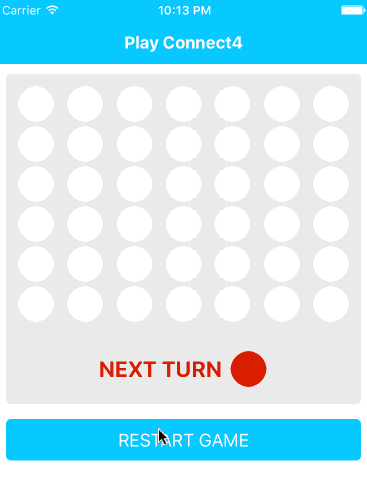

# ExponentJS Connect4 Game

I recommend checking out the [ExponentJS Docs](https://exponentjs.com/docs) to learn how to get this game up and running.

Already have ExponentJS setup on your phone? Check out the live app using its `exp` address: `exp://exp.host/@sergiocruz/connect4`

## How it works

This is a simple implementation of the classic [Connect Four game](https://en.wikipedia.org/wiki/Connect_Four). To play, simply have a buddy next you and hand over the phone when it's their time to play. After they'll play they'll hand the phone back over to you, etc.

## Next steps

As a next step I might turn this game into a full-on online multiplayer game. A few steps will be necessary to support this next major feature:

- [ ] Give users option to play locally or online
- [ ] Develop backend module to connect remote players
- [ ] Figure out how to handle game restarts (can any players restart the game at any time? etc.)

## Ideas?

If you have any ideas, feel free to [open an issue](https://github.com/sergiocruz/react-native-connect4/issues/new) so we can discuss it and get it done!
